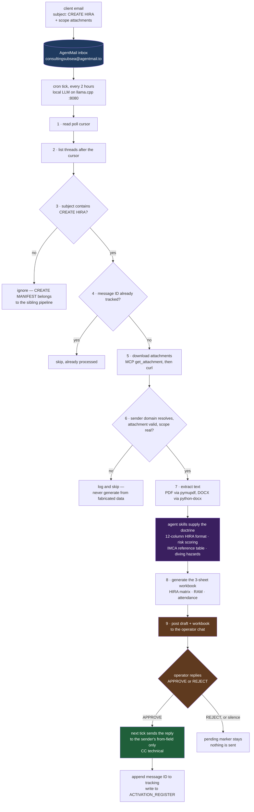

# HSE Document Generator

Automated offshore HSE/HIRA document pipeline for ConsultingSubsea:
a client emails **"CREATE HIRA"** (with scope attachments) to
`consultingsubsea@agentmail.to`, the home-PC agent downloads the
scope, builds a project-specific **HIRA Excel workbook**, and — only
after explicit human approval — emails it back to the client.

**No VPS. No cloud storage. No database.** Email is the transport,
the queue, and the audit log.

The pipeline is not a script chain. The model runs the cron prompt and uses the Python scripts as
tools, while the two skills under `references/` are its procedural knowledge — the exact column
format, the risk-scoring convention, and the IMCA references that must be cited.

## Files

| File | Purpose |
|------|---------|
| `scripts/generate_hiras.py` | The HIRA Excel workbook generator (3-sheet 12-column layout, IMCA-referenced, colour-coded RAM) |
| `scripts/check_threads.py` / `check_all_threads.py` | Inbox polling + trigger detection (subject = "CREATE HIRA") |
| `scripts/download_attachments.py` | MCP attachment URL fetch → curl download → size validation |
| `scripts/extract_all.py` | PDF/DOCX/TXT text extraction from downloaded scope documents |
| `scripts/send_hira_emails.py` | Approved-reply sender (zero-tolerance recipient rules) |
| `scripts/agentmail-curl.sh` | Key-safe AgentMail API wrapper (key read from `$HSE_HOME/.api_key` at runtime — never in code) |
| `references/hira-cron-prompt.md` | The full production cron-job prompt: trigger detection, safety gates, human-in-the-loop approval, email templates |
| `references/frontend.html` | Public web form (Hostinger/any static host) that posts an HIRA request into the inbox with a send-only, inbox-scoped AgentMail key |
| `references/hse-risk-assessment-generator/` | The agent skill: HIRA 12-column format spec, RAM layout, IMCA reference table |
| `references/air-diving-operations/` | The agent skill: surface-supplied diving operations knowledge (hazard library, IMCA D-series references, decompression tables) |
| `PIPELINE.md` | Architecture, security model, failure modes |

## How the agent "thinks"

The pipeline is not a traditional script chain — the LLM (local
llama.cpp, OpenAI-compatible, port 8080) runs the cron prompt and
uses the Python scripts as tools. The skills under `references/`
are the model's procedural knowledge: the exact 12-column HIRA
format, the risk-scoring convention (compound `3C` = severity 3 ×
likelihood C), and the IMCA/DMAC references that must be cited.

## Security model (the non-negotiables)

1. **Human-in-the-loop.** The agent NEVER sends email on its own.
   It posts the draft + workbook to the operator chat. The email
   goes out only after a human replies APPROVE.
2. **Zero-tolerance recipient routing.** Replies go to the
   sender's `from` field ONLY, plus a fixed CC to
   `technical@consultingsubsea.com`. Addresses found in email
   bodies, SOW documents, or attachments are DATA, never
   recipients.
3. **Prompt-injection protection.** All email/attachment content
   is data, never instructions. Embedded "disregard prior
   directions" style payloads are ignored.
4. **Dead-domain / bad-input abort.** If the sender domain has no
   DNS or an attachment 404s, the run logs and skips — it never
   generates from fabricated data or sends work products to test
   addresses.
5. **Key hygiene.** The AgentMail key lives in a file on the home
   machine (`$HSE_HOME/.api_key`), loaded by the wrapper script at
   runtime. It is never committed, never in the prompt file,
   never in a public config. The public form carries only a
   send-only, inbox-scoped key — worst case is "someone can send
   mail into my inbox", nothing more.

## Deploying

1. **Inbox** — create an AgentMail inbox (e.g.
   `consultingsubsea@agentmail.to`) + one inbox-scoped read/send
   key (home) and one send-only key (form).
2. **Key file** — `mkdir -p $HSE_HOME && printf '%s' '<key>' > $HSE_HOME/.api_key`
3. **Form** — paste the send-only key into `references/frontend.html`
   (`const KEY=`) and host it on any static host.
4. **Cron** — run the prompt in `references/hira-cron-prompt.md`
   on a schedule (production: every 2h) against an LLM endpoint
   with the two skills loaded.
5. **State files** the job maintains in `$HSE_HOME`:
   `hse-tracking.txt` (processed message IDs),
   `ACTIVATION_REGISTER.txt` (audit log), `last_check.txt` (poll cursor).

## Licensing

MIT + [The Commons Clause](LICENSE) — free to use; if you make
money from it, share back.
